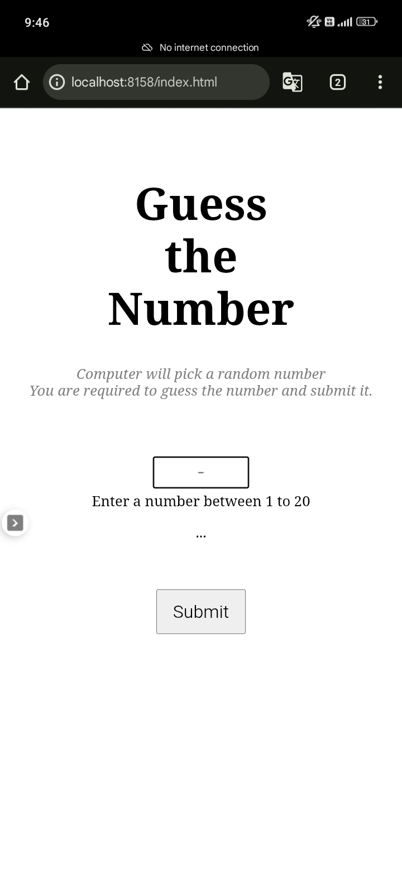
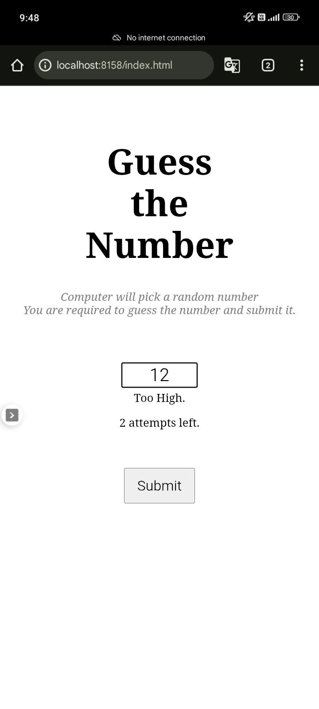
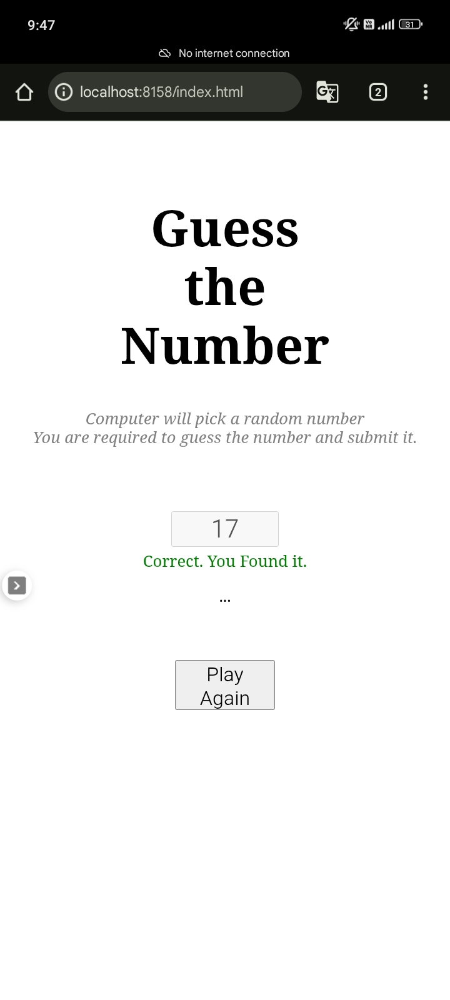

# 🎯 Guess the Number Game

A simple browser-based Guess the Number game built using **HTML, CSS, and JavaScript**.

## 📌 Description
The computer generates a random number within a given range, and the player must guess the number within limited attempts.  
The game provides hints like **Too High** or **Too Low** and shows remaining attempts.

## 🚀 Features
- Random number generation
- Limited attempts
- Hint system (Too High / Too Low)
- Input validation
- Play Again option
- Simple UI

## 🛠️ Technologies Used
- HTML
- CSS
- JavaScript (Vanilla JS)

## ▶️ How to Play
1. Enter a number in the input box
2. Click **Submit**
3. Follow the hints
4. Guess the correct number before attempts run out
5. Click **Play Again** to restart

## 📷 Preview
Simple number guessing game running in the browser.

## 📂 Project Purpose
This project was made for practicing **JavaScript logic and DOM manipulation**.
